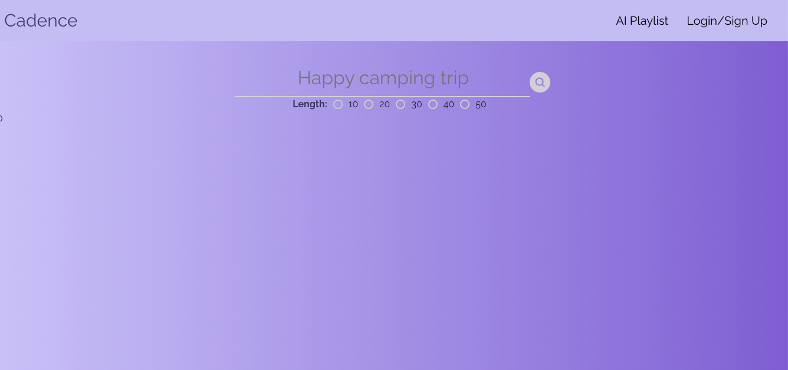
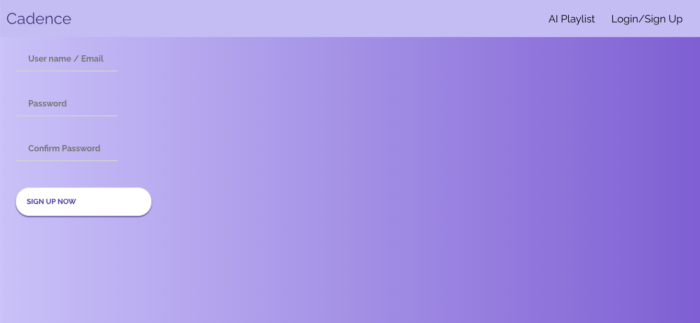
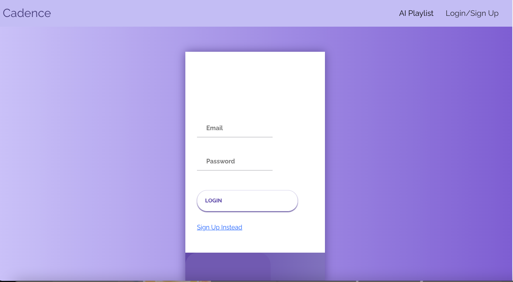
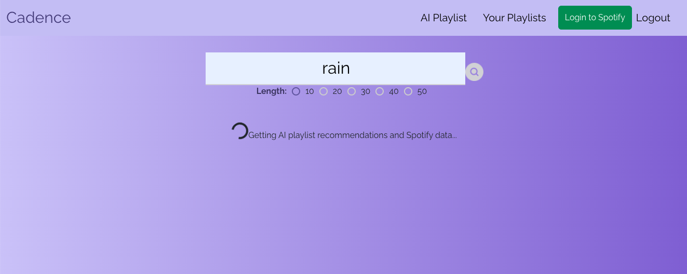
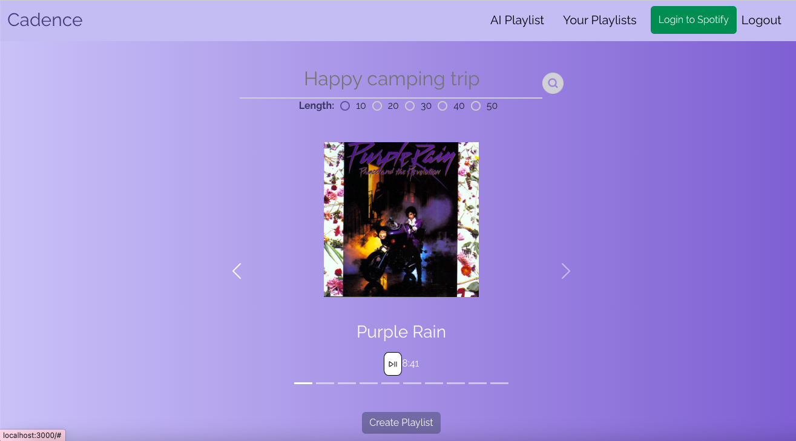
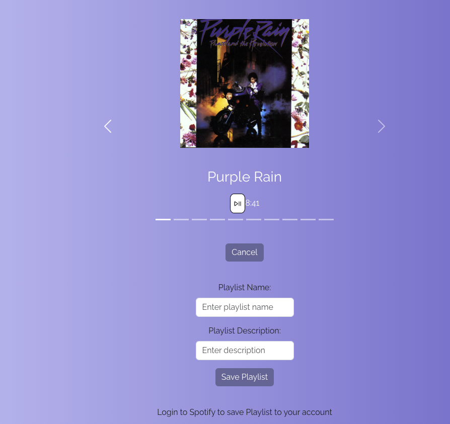

# Cadence

## Description:
Elevate Your Music Experience with the Spotify API and React App.
Discover a new way to immerse yourself in the world of music with our Spotify API-powered React app. Seamlessly merging the capabilities of Spotify's vast music library with the versatility of React, our app offers a user-friendly interface that lets you explore, create, and enjoy music like never before. 

## Table of Contents

- [Description](#description)
- [Usage](#usage)
- [Demonstration](#demonstration)
- [Contributions](#contributions)
- [Links](#links)
- [Credits](#credits)
- [Technologies](technologies)
- [License](#license)

## Usage:

**User**: As a Cadence user, you have the ability to:
- Register for an account
- Access your account
- Create your own music collections
- Enjoy your favorite tunes
- Update your playlists
- Remove playlists as needed
- Sign out

**Interface**: Feel free to explore Cadence through our Heroku link:

## Demonstration:

1. **Home Page** 

2. **Register for an account** 

3. **Access your account**

4. **Create your own music collections** 

5. **Enjoy your favorite tunes** 

6. **Create your playlists** 

7. **View Your playlists**

## Contributions: 

We welcome contributions to Cadence! If you have ideas for improvements, bug fixes, or new features, feel free to submit a pull request.

To contribute to Cadence, please follow these steps:

1. Fork the repository.
2. Create a new branch for your feature or bug fix.
3. Make your changes in the new branch.
4. Commit your changes, providing a descriptive commit message.
5. Push your branch to your forked repository.
6. Open a pull request against the main repository.
7. Provide a clear and concise description of your changes in the pull request.
8. Submit the pull request and wait for feedback or further instructions.

Please note that by submitting a pull request, you agree to allow the project maintainers to license your work under the project's existing license.

We appreciate your interest in contributing to Cadence.

## Links: 

- [GitHub Repository](https://github.com/kemcclen/Cadence) 
- [Deployed page]() 

## Credits
- [gaomaoyuan](https://github.com/gaomaoyuan)  - Gao Maoyuan
- [kemcclen](https://github.com/kemcclen)  - Katharine McClenaghan
- [Shaun-Nelson](https://github.com/Shaun-Nelson)  - Shaun Nelson
- [Shok1to](https://github.com/Shok1to)  - Shoko Takahashi

## Technologies
- React
- GraphQL with a Node.js and Express.js server
- MongoDB and the Mongoose ODM for the database
- Queries and mutations for retrieving, adding, updating, and deleting data
- JWT authentication
- API
- Heroku

## License:
Cadence is licensed under the [MIT License](https://opensource.org/license/mit/).

_The MIT License is a permissive open-source license that allows you to use, modify, and distribute the project for both commercial and non-commercial purposes. It provides you with the freedom to customize the application to suit your needs._

_By contributing to Cadence, you agree that your contributions will be licensed under the same MIT License. This ensures that the project remains open-source and accessible to the community._

This section has moved here: [https://facebook.github.io/create-react-app/docs/advanced-configuration](https://facebook.github.io/create-react-app/docs/advanced-configuration)

### Deployment

This section has moved here: [https://facebook.github.io/create-react-app/docs/deployment](https://facebook.github.io/create-react-app/docs/deployment)

### `npm run build` fails to minify

This section has moved here: [https://facebook.github.io/create-react-app/docs/troubleshooting#npm-run-build-fails-to-minify](https://facebook.github.io/create-react-app/docs/troubleshooting#npm-run-build-fails-to-minify)
